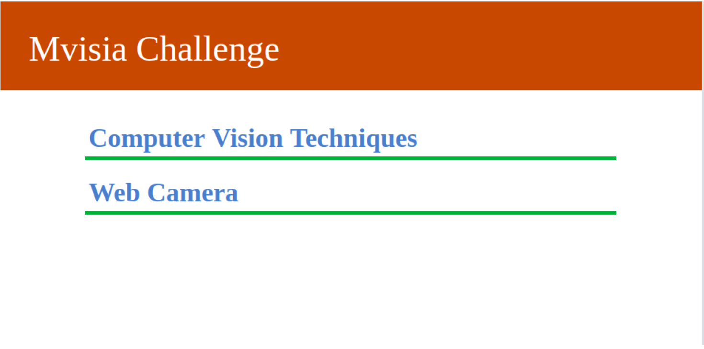

# Creation of API Web to Use Computer Vision Techniques Classic.

[](https://travis-ci.org/ImaginaryLandscape/django-version-viewer)

## About this API

<p align="center">
<h6 align="center">Screen main API.</h6>

This application was developed as coding interview of the company **MVISIA**. This challenge is complete, and, along of the month, I going to update the readme to explain more about the techiniques that used.

**Note**: if you know **classic computer vision**, **django framework**, and **basic computer newtworks** you can undertand this application. Otherwise, acquire these skills.

## Intall Packages
 * Create of virtual environments (venv) in macOS or Linux.
  ```
   $ python3 -m pip install --user virtualenv
  ```
 * Matplotlib (macOS)
  ```
    $ python -m pip install -U matplotlib
  ```
  * Django
  ```
    $ python -m pip install Django
  ```
  * OpenCV
  ```
    $ pip install opencv-python
  ```


## Run API
    
* OpenCV
    ```
    $ python manage.py runserver 127.0.0.1:8000
    ```

## Acknowledgment

I would like to thank the [MVISIA company](https://www.mvisia.com.br) for the opportunity offered, as
implementation of this application turned out to be an interesting challenge and
contribution to improving my skills.

#
<p align="center"><b>Sincerely:</b> <a href="https://github.com/neemiasbsilva">Neemias B. Silva</a></p>
